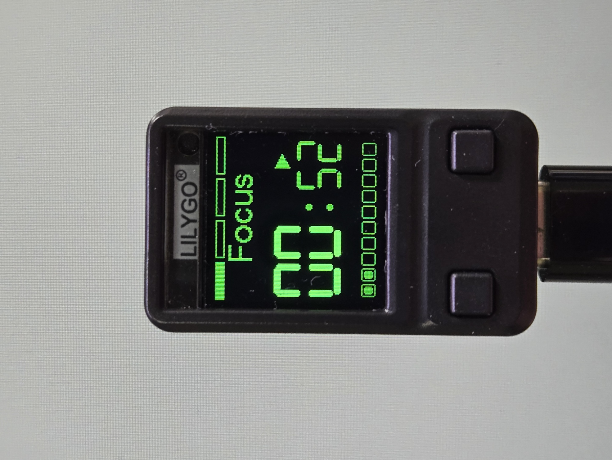
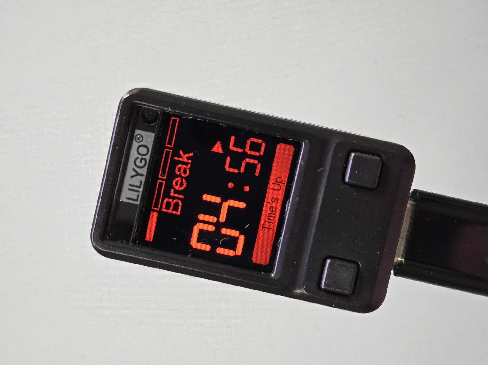

# Mini Pomodoro Timer for LilyGo T-QT Pro

[English README](README_EN.md)

## 執行畫面

| 工作倒數 | 倒數與狀態顯示 |
|---|---|
|  |  |

這是一個專為 [LilyGo T-QT Pro](https://github.com/Xinyuan-LilyGO/T-QT)
設計的番茄鐘韌體，使用 ESP32-S3 與板載 GC9A01 128×128 彩色 LCD。

專案提供可調整的工作倒數、一般休息、四輪循環長休息、七段數字顯示、
雙層進度條，以及透過板載按鍵完成所有操作。

## 主要功能

- 開機預設工作時間為 25 分鐘。
- 工作時間可在 5～60 分鐘之間調整，預設每次增減 5 分鐘。
- 右鍵每次調整的分鐘數可由 Web 介面修改。
- 分鐘與秒數均使用七段顯示樣式。
- 秒數約為分鐘字體高度的 2/3，並靠畫面右側顯示。
- 工作結束後自動開始 5 分鐘休息。
- 每完成四次工作後，自動開始 20 分鐘長休息。
- 休息結束後停留在前景與背景配色互換的 `00:00` 畫面：短休息為暗紅底黑字，
  長休息為暗白底黑字；須按左鍵開始下一次工作。
- 右鍵手動調整的工作時間會自動保存，下次開機繼續使用。
- 倒數結束時，底部反白顯示 `Time's Up` 5 秒。
- 底部 10 段進度條依剩餘時間逐段減少。
- 頂部四段進度條顯示目前的工作輪次。
- 支援開始、暫停、停止及重設狀態圖示。
- 停止或暫停 10 分鐘後自動關閉背光，按任一按鍵喚醒。
- 開機後提供 3 分鐘 Wi-Fi Hotspot 與 Web 設定介面。
- Web 設定會保存至 ESP32 NVS，重新開機仍會套用。
- 可在 LCD 顯示 Hotspot QR Code、SSID 與 Web IP。
- 使用 128×128 離屏 Sprite 一次更新完整畫面，降低每秒重繪閃爍。
- 包含按鍵消抖與長短按互斥判定。

## 硬體需求

| 項目 | 規格 |
|---|---|
| 開發板 | LilyGo T-QT Pro |
| MCU | ESP32-S3 |
| LCD | GC9A01，128×128 |
| Flash | 4 MB |
| PSRAM | 2 MB |
| 工作／暫停按鍵 | 左鍵（GPIO0） |
| 設定／重設按鍵 | 右鍵（GPIO47） |

目前專案設定對應 LilyGo T-QT Pro N4R2（4 MB Flash／2 MB PSRAM）。

## 使用方法

### 左鍵：開始與暫停

- 短按：開始倒數。
- 倒數進行中短按：暫停。
- 暫停時短按：繼續倒數。
- 左鍵沒有長按功能。

### 右鍵：設定時間與重設

尚未開始工作倒數時：

- 短按：增加 5 分鐘。
- 長按 2 秒：減少 5 分鐘。
- 增加至 60 分鐘後再增加，會循環回 5 分鐘。
- 減少至 5 分鐘後再減少，會循環回 60 分鐘。

進入工作或休息倒數流程後：

- 長按 2 秒：重設整個番茄鐘循環。
- 重設後回到第 1 次工作與停止狀態。
- 重設不會改變使用者設定的工作時間。

### 左鍵＋右鍵：Hotspot 資訊

開機後 Hotspot 有效的 3 分鐘內，同時短按左鍵與右鍵：

- LCD 顯示可加入 `MiniPomodoro` Hotspot 的 QR Code。
- QR Code 下方顯示 Web 介面 IP `192.168.4.1`。
- 顯示 QR Code 時按任一按鍵可返回番茄鐘畫面。

> T-QT 的 GPIO1 已連接 LCD Reset，不能作為按鍵使用，因此組合鍵使用
> 板載左鍵與右鍵。

## 工作循環

1. 開機後顯示預設的 25 分鐘工作時間，狀態為停止。
2. 按一下左鍵開始第 1 次工作。
3. 工作倒數結束後，自動開始 5 分鐘一般休息。
4. 一般休息結束後停在暗紅底、黑字的 `Break 00:00` 畫面。
5. 按下左鍵後切換到下一次工作並立即開始倒數。
6. 重複工作與一般休息。
7. 第 4 次工作結束後，自動進入 20 分鐘長休息。
8. 長休息結束後停在暗白底、黑字的 `Time Off 00:00`；按左鍵後清除四輪
   紀錄並立即開始第 1 次工作。

若 Web 啟用「休息後自動開始」，則忽略配色互換的等待畫面，休息結束後直接
開始下一次工作倒數。

## 畫面配置

### 頂部輪次進度條

- 高度為 7 pixel。
- 與標題列相隔 2 pixel。
- 平均分為四段。
- 尚未執行的輪次顯示中空外框。
- 執行第 n 次工作時，前 n 段顯示實心。
- 一般休息時保留已完成的輪次。
- 長休息時四段全部顯示中空。

### 標題

| 階段 | 顯示文字 |
|---|---|
| 工作 | `Focus` |
| 一般休息 | `Break` |
| 長休息 | `Time Off` |

標題使用約 26 pixel 高的 TFT_eSPI Font 4。

### 倒數時間

- 分鐘位於左側，單一數字尺寸約 25×51 pixel。
- 秒數靠右，單一數字尺寸約 16×34 pixel。
- 冒號位於分鐘與秒數間距的中央。
- 分鐘與秒數均使用兩位數，包含前導零。

### 狀態圖示

狀態圖示位於秒數上方靠右：

| 圖示 | 狀態 |
|---|---|
| 播放三角形 | 工作或休息倒數進行中 |
| `‖` | 工作或休息倒數暫停 |
| 實心方塊 | 開機、手動重設，或休息結束後的配色互換 `00:00` 等待畫面 |

### 底部倒數進度條

- 分成 10 段。
- 依目前階段的剩餘時間比例逐段減少。
- 倒數結束時反白顯示 `Time's Up` 5 秒，之後恢復進度條。

## 顏色設定

| 階段 | 分鐘 | 秒數、冒號、標題與進度條 |
|---|---|---|
| 工作 | 亮綠色 | 暗綠色 |
| 一般休息 | 亮紅色 | 暗紅色 |
| 長休息 | 亮白色 | 暗白色／灰色 |

此專案使用的舊批次面板具有紅藍通道交換特性，因此程式會在顏色輸出層
補償通道順序，讓實際 LCD 顯示正確的紅色。

## 時間與按鍵參數

| 參數 | 預設值 |
|---|---:|
| 工作時間 | 25 分鐘 |
| 工作時間最小值 | 5 分鐘 |
| 工作時間最大值 | 60 分鐘 |
| 每次調整量 | 5 分鐘 |
| 一般休息 | 5 分鐘 |
| 長休息 | 20 分鐘 |
| 長休息週期 | 每 4 次工作 |
| 右鍵長按時間 | 2 秒 |
| 按鍵消抖時間 | 30 ms |
| `Time's Up` 顯示時間 | 5 秒 |
| 無倒數背光關閉時間 | 10 分鐘 |
| 預設背光亮度 | 90% |
| 背光調整級數 | 10 段，每段 10% |
| 右鍵預設調整量 | 5 分鐘 |
| Hotspot 有效時間 | 開機後 3 分鐘 |

主要參數定義於 [`src/main.cpp`](src/main.cpp) 開頭，可依需求修改。

## Web 設定介面

每次開機會自動建立以下 Wi-Fi Hotspot：

| 項目 | 設定 |
|---|---|
| SSID | `MiniPomodoro` |
| 密碼 | 無，開放式 Hotspot |
| Web IP | `http://192.168.4.1` |
| 有效時間 | 開機後 3 分鐘 |

連上 Hotspot 後，以瀏覽器開啟 `http://192.168.4.1`。Hotspot 到期後會
關閉 Wi-Fi，該次開機不會再次啟動。

Web 介面可調整：

- 背光亮度：10%～100%，每次 10%。
- 右鍵每次調整的分鐘數：預設 5 分鐘。
- 工作倒數上限：預設 60 分鐘。
- 工作時間：預設 25 分鐘，不能超過設定的上限。
- 一般休息時間：預設 5 分鐘。
- 長休息時間：預設 20 分鐘。
- 休息結束後是否自動開始下一次工作；預設關閉，顯示配色互換的 `00:00`
  並等待左鍵。

按下 `Save` 會保存並立即套用設定。按下 `Reset` 會恢復上述所有預設值。

## 背光休眠

- 目前預設背光亮度為 90%。
- 停止或暫停且連續 10 分鐘沒有進行倒數時，背光自動關閉。
- 工作或休息倒數進行中不會關閉背光。
- 背光關閉後，按左鍵或右鍵均可喚醒。
- 用來喚醒的第一次按鍵不會同時觸發開始、設定或重設操作。

## 防閃爍繪圖

早期版本在每次秒數變化時，會先直接清除 LCD 上的時間、標題及進度條
區域，再逐項重新繪製。清除與重畫之間的短暫黑畫面，偶爾會被肉眼看成
閃爍，Wi-Fi 運作期間尤其容易察覺。

目前版本使用 `TFT_eSprite` 建立一個 128×128、16-bit 的離屏畫面緩衝：

1. 每秒先在記憶體中的 Sprite 清除並繪製完整番茄鐘畫面。
2. 所有數字、標題、圖示及進度條完成後，才呼叫 `pushSprite()`。
3. 完整畫面透過一次傳輸更新到實體 LCD，不顯示中間繪製過程。

Sprite 緩衝約使用 32 KB RAM；T-QT Pro 的記憶體足以負擔。Hotspot QR
Code 屬於獨立畫面，仍直接繪製至 LCD，不影響倒數畫面的防閃爍流程。

## LCD 與板型設定

| 項目 | 設定 |
|---|---|
| LCD 驅動 | GC9A01 |
| 解析度 | 128×128 |
| SPI 控制器 | HSPI |
| SPI 頻率 | 40 MHz |
| MOSI | IO2 |
| SCLK | IO3 |
| CS | IO5 |
| DC | IO6 |
| LCD Reset | IO1 |
| 背光 | IO10，LOW 開啟 |
| 面板初始化 | LilyGo `old_panel` |
| CGRAM 起始偏移 | `(0,0)` |

零 CGRAM 偏移是針對目前面板批次的校正，用來消除畫面上方 1 pixel 與
左側 2 pixel 的雜色線。

## 開發環境

本專案使用 [PlatformIO](https://platformio.org/) 與 Arduino framework。

首次編譯前，請在專案根目錄下載 LilyGo 官方 T-QT 驅動：

```powershell
git clone --depth 1 https://github.com/Xinyuan-LilyGO/T-QT.git vendor/T-QT
```

建置前腳本 `scripts/use_old_panel.py` 會自動：

1. 選用 LilyGo 官方 `old_panel` GC9A01 初始化檔。
2. 套用目前面板需要的 `(0,0)` CGRAM 偏移校正。
3. 從 LilyGo 內附 LVGL 提取輕量 QR Code 編碼器，不編譯完整 LVGL。

## 編譯

在專案根目錄執行：

```powershell
pio run
```

編譯完成的韌體位於：

```text
.pio/build/t-qt-pro/firmware.bin
```

## 燒錄

自動偵測序列埠並燒錄：

```powershell
pio run --target upload
```

指定序列埠，例如 COM6：

```powershell
pio run --target upload --upload-port COM6
```

如果無法自動進入下載模式，請按住板上的 BOOT 按鍵，重新連接 USB 後再
執行燒錄。

## 專案結構

```text
MiniPomodoroTimer/
├── platformio.ini
├── README.md
├── scripts/
│   └── use_old_panel.py
├── lib/
│   └── qrcodegen/      # 建置時自動產生
├── src/
│   └── main.cpp
└── vendor/
    └── T-QT/          # LilyGo 官方 T-QT 驅動，不納入版本控制
```

## 致謝

本專案使用 LilyGo 官方 T-QT 硬體定義及修改版 TFT_eSPI 顯示驅動。

本專案的需求整理、程式設計、除錯、顯示校正、文件撰寫與韌體燒錄，
均由 OpenAI Codex 協助完成。
